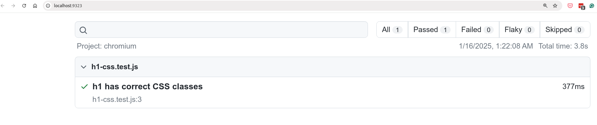
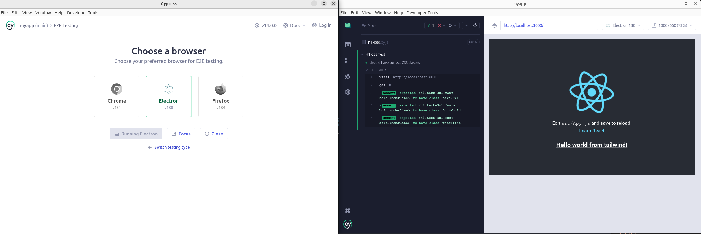

### CSS Tests with Jest

Jest CSS tests with React and Tailwind CSS. Works like this
react-testing-library is used to render the component and then we can check the CSS classes.

```javascript
import { render, screen } from '@testing-library/react';
import App from './App';

test('renders learn react link', () => {
  render(<App />);
  const linkElement = screen.getByText(/learn react/i);
  expect(linkElement).toBeInTheDocument();
});

test('[CSS-TEST] h1 has underline class', () => {
  render(<App />);
  const h1Element = screen.getByText(/Hello world from tailwind!/i);

  // checking all CSS
  expect(h1Element).toHaveClass('underline');
  expect(h1Element).toHaveClass('text-3xl');
  expect(h1Element).toHaveClass('font-bold');
});
```

### Results

```bash
./run-tests.sh
```

```
 PASS  src/App.test.js
  ✓ renders learn react link (51 ms)
  ✓ [CSS-TEST] h1 has underline class (10 ms)

Test Suites: 1 passed, 1 total
Tests:       2 passed, 2 total
Snapshots:   0 total
Time:        0.974 s, estimated 2 s
Ran all test suites.
```

### CSS Tests with Jest Snapshots

Snapshot tests works by rendering the component and then taking a snapshot of the rendered component. The snapshot is a JSON representation of the rendered component. The snapshot is saved in a file with the same name as the test file.

This saves to do many assetions in a single test. The snapshot is compared with the previous snapshot. If the snapshot is different, the test will fail.

WE can test CSS with this. The snapshot will contain the CSS classes.

```javascript
test('matches snapshot', () => {
  const { asFragment } = render(<App />);
  expect(asFragment()).toMatchSnapshot();
});
```

### Results

```
 PASS  src/App.test.js
  ✓ renders learn react link (48 ms)
  ✓ [CSS-TEST] h1 has underline class (7 ms)
  ✓ matches snapshot (15 ms)

 › 1 snapshot written.
Snapshot Summary
 › 1 snapshot written from 1 test suite.

Test Suites: 1 passed, 1 total
Tests:       3 passed, 3 total
Snapshots:   1 written, 1 total
Time:        1.421 s
Ran all test suites related to changed files.

Watch Usage
 › Press a to run all tests.
 › Press f to run only failed tests.
 › Press q to quit watch mode.
 › Press p to filter by a filename regex pattern.
 › Press t to filter by a test name regex pattern.
 › Press Enter to trigger a test run.

 PASS  src/App.test.js
  ✓ renders learn react link (13 ms)
  ✓ [CSS-TEST] h1 has underline class (10 ms)
  ✓ matches snapshot (8 ms)

Test Suites: 1 passed, 1 total
Tests:       3 passed, 3 total
Snapshots:   1 passed, 1 total
Time:        0.163 s, estimated 1 s
Ran all test suites.

Watch Usage: Press w to show more.
```

### CSS Test with Playwright

Playwright is a Node library to automate the Chromium, WebKit and Firefox browsers. It enables cross-browser web automation. Playwright will run the tests in the browser and check the CSS classes.
Rendering the real browser and checking the CSS classes.

Setup Playwright
```bash
sudo apt-get install libavif13 
npx playwright install
```

Run
```bash
./run-playwright-tests.sh
```

### Results

```
Running 1 test using 1 worker
  1 passed (3.8s)

To open last HTML report run:

  npx playwright show-report

❯ npx playwright show-report


  Serving HTML report at http://localhost:9323. Press Ctrl+C to quit.
^C
```



### Cypress

We can do E2E Tests end also CSS tests with Cypress. Cypress is tool where we can run tests on the browers: Chrome, Firefox, Electron, etc.
We render the page and do assertions.

Terminal #1
```
npm run start
```

Terminal #2
```bash
./run-cypress-tests.sh
```

### Results

